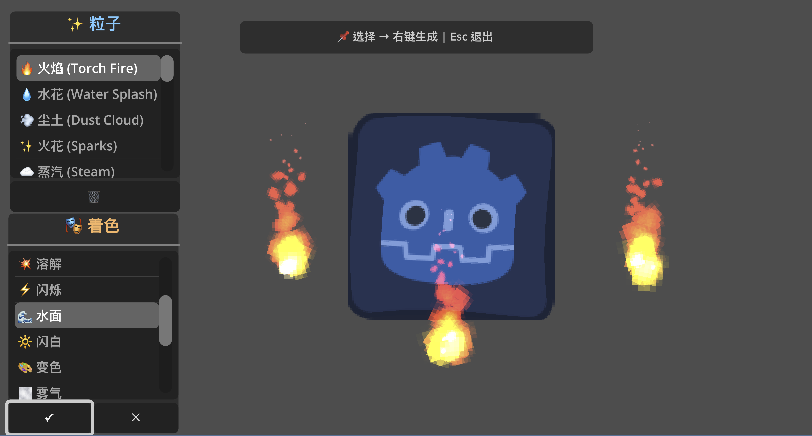

# Godot VFX Library

[](https://godotengine.org)
[](https://opensource.org/licenses/MIT)
[](https://github.com/yourusername/godot-vfx-library/releases)

**[中文版](README_CN.md) | English**



A comprehensive collection of **35+ particle effects** and **17+ shaders** for Godot 4, designed specifically for action games like Metroidvania and platformers.

## ✨ Features

### 🎆 Particle Effects (35+)
- **Combat Effects**: Blood splash, energy burst, shield break, sparks, combo rings
- **Movement Effects**: Dash trails, jump dust, wall slide sparks  
- **Spell/Skill Effects**: Portal vortex, lightning chain, ice frost, fireball trails
- **Environmental Effects**: Torch fire, fireflies, steam, water splash, falling leaves, rain, snow

### 🎨 Shader Effects (17+)
- **Character Status**: Flash white, blink, dissolve, frozen, poison, burning, petrify
- **Environmental**: Water surface, heat distortion, portal vortex, energy barrier
- **Post-Processing**: Outline glow, radial blur, chromatic aberration, grayscale

### 🎮 Easy-to-Use Managers
- **VFX Manager**: Global combat and UI effects with simple API
- **EnvVFX Manager**: Environmental and atmospheric effects
- **Screen Effects**: Camera shake, freeze frame, damage numbers
- **Auto-cleanup**: Smart memory management for one-shot effects

## 🚀 Quick Start

### Installation

1. **Asset Library** (Recommended)
   - Open Godot 4.5+
   - Go to **AssetLib** tab
   - Search for "VFX Library"
   - Click **Download** → **Install**

2. **Manual Installation**
   - Download the latest release
   - Extract to your project's `addons/` folder
   - Enable "VFX Library" in Project Settings → Plugins

3. **Git Submodule**
   ```bash
   git submodule add https://github.com/yourusername/godot-vfx-library.git addons/vfx_library
   ```

### Basic Usage

```gdscript
# Screen shake on impact
VFX.screen_shake(10.0, 0.2)

# Blood splash effect
VFX.spawn_blood_splash(enemy.global_position)

# Flash white on damage
VFX.flash_white(player_sprite, 0.1)

# Environmental torch
EnvVFX.create_torch(self, Vector2(100, 50))

# Weather effects
EnvVFX.create_rain(self, 600)
```

## 📖 Documentation

- **[Installation Guide](INSTALLATION.md)** - Detailed setup instructions
- **[API Reference](API_REFERENCE.md)** - Complete function documentation
- **[Demo Examples](addons/vfx_library/demo/)** - Interactive demo scene

## 🎯 Use Cases

**Combat Systems** - Blood splashes, screen shake, damage numbers, critical hit effects  
**Movement Mechanics** - Dash trails, jump dust, wall slide sparks  
**Environmental Design** - Fire sources, weather effects, ambient particles  
**Spell & Magic** - Portal vortex, lightning chains, summoning circles  
**Status Effects** - Visual feedback for freeze, poison, burning states

See the [API Reference](API_REFERENCE.md) for detailed code examples.

## 🎮 Demo

Run the interactive demo scene:
1. Open `addons/vfx_library/demo/vfx_demo.tscn`
2. Press **Play Scene** (F6)
3. Use keyboard shortcuts to test effects:
   - **Q/W/E/R/T** - Environmental effects
   - **Z/X/C/V/B** - Elemental combat effects  
   - **1-9** - Various particle effects

## 🎨 Customization

All effects are **scene-based** (.tscn files) for easy visual editing:

```
addons/vfx_library/
├── effects/          # Particle effect scenes
├── shaders/          # Shader files
├── demo/             # Demo project
└── docs/             # Documentation
```

- **Particle Effects**: Edit `.tscn` files directly in Godot editor
- **Shaders**: Modify `.gdshader` files or create variants
- **Colors & Timing**: Adjust via GDScript parameters
- **Manager APIs**: Extend `vfx.gd` and `env_vfx.gd` for custom effects

## 🤝 Contributing

We welcome contributions! Please see [CONTRIBUTING.md](CONTRIBUTING.md) for guidelines.

### How to Contribute
- 🐛 **Report bugs** via GitHub Issues
- 💡 **Suggest features** for new effects or improvements  
- 🎨 **Submit effects** - new particles, shaders, or presets
- 📖 **Improve docs** - examples, tutorials, translations

## 📝 License

This project is licensed under the MIT License - see the [LICENSE](LICENSE) file for details.

## 🙏 Acknowledgments

- Built for **Godot 4.5+** 
- Inspired by classic Metroidvania and action games
- Community feedback and contributions
- Special thanks to Godot community for excellent documentation

---

⭐ **Star this repository** if it helps your project!

**Questions?** Open an issue or check the [documentation](API_REFERENCE.md).