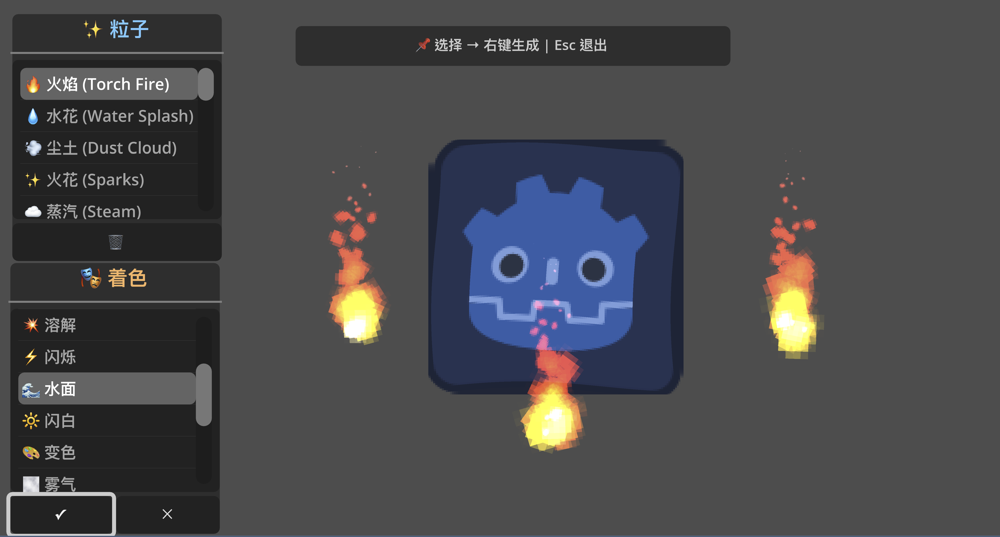

# Godot VFX 特效库

[](https://godotengine.org)
[](https://opensource.org/licenses/MIT)
[](https://github.com/yourusername/godot-vfx-library/releases)

**中文版 | [English](README.md)**



为 Godot 4 提供的综合性特效库，包含 **35+ 粒子特效** 和 **17+ 着色器**，专为类恶魔城和平台跳跃等动作游戏设计。

## ✨ 特性

### 🎆 粒子特效 (35+)

- **战斗特效**: 血液飞溅、能量爆发、护盾破碎、火花、连击环
- **移动特效**: 冲刺残影、跳跃尘土、墙壁滑行火花
- **法术/技能特效**: 传送门漩涡、闪电链、冰霜、火球拖尾
- **环境特效**: 火把火焰、萤火虫、蒸汽、水花、落叶、雨雪

### 🎨 着色器特效 (17+)

- **角色状态**: 受击闪白、无敌闪烁、溶解、冰冻、中毒、燃烧、石化
- **环境效果**: 水面波纹、热浪扭曲、传送门漩涡、能量屏障
- **后处理**: 发光轮廓、径向模糊、色差、灰度效果

### 🎮 易用的管理器

- **VFX 管理器**: 全局战斗和 UI 特效，简单 API
- **EnvVFX 管理器**: 环境和大气特效
- **屏幕效果**: 屏幕震动、冻结帧、伤害数字
- **自动清理**: 一次性特效的智能内存管理

## 🚀 快速开始

### 安装

1. **手动安装**
   - 下载最新版本
   - 解压到项目的 `addons/` 文件夹
   - 在项目设置 → 插件中启用 "VFX Library"

2. **Git Clone**（推荐）
   ```bash
   cd your-project/addons/
   git clone https://github.com/haowg/GODOT-VFX-LIBRARY.git vfx_library
   ```
   **重要**: 克隆到 `addons/vfx_library` (而不是 `GODOT-VFX-LIBRARY`)

3. **软链接**（开发推荐）
   ```bash
   # 克隆到中心位置（只需一次）
   git clone https://github.com/haowg/GODOT-VFX-LIBRARY.git ~/godot-plugins/GODOT-VFX-LIBRARY
   
   # 在项目中创建软链接
   cd your-project/addons/
   ln -s ~/godot-plugins/GODOT-VFX-LIBRARY/addons/vfx_library vfx_library
   ```
   适合在多个项目中使用同一插件！

详细安装说明和故障排除，请查看 [INSTALLATION.md](INSTALLATION.md)。

### 基本用法

```gdscript
# 屏幕震动
VFX.screen_shake(10.0, 0.2)

# 血液飞溅特效
VFX.spawn_blood_splash(enemy.global_position)

# 受击闪白
VFX.flash_white(player_sprite, 0.1)

# 环境火把
EnvVFX.create_torch(self, Vector2(100, 50))

# 天气效果
EnvVFX.create_rain(self, 600)
```

## 📖 文档

- **[安装指南](INSTALLATION.md)** - 详细安装说明
- **[API 参考](API_REFERENCE.md)** - 完整函数文档
- **[演示示例](addons/vfx_library/demo/)** - 交互式演示场景

## 🎯 应用场景

**战斗系统** - 血液飞溅、屏幕震动、伤害数字、暴击特效  
**移动机制** - 冲刺残影、跳跃尘土、墙壁滑行火花  
**环境设计** - 火源、天气效果、环境粒子  
**法术魔法** - 传送门漩涡、闪电链、召唤阵  
**状态效果** - 冰冻、中毒、燃烧状态的视觉反馈

详细代码示例请参考 [API 参考](API_REFERENCE.md)。

## 🎮 交互式演示

体验所有特效的交互式演示场景：

1. 在 Godot 中打开 `addons/vfx_library/demo/vfx_demo.tscn`
2. 按 **F6**（播放场景）
3. 从 UI 列表选择特效，右键点击生成
4. 实时测试所有 35+ 粒子效果和 17+ 着色器

**功能特点：**
- 📋 按类别浏览特效（战斗、天气、环境等）
- 🎨 测试带动画预览的着色器效果
- 🧪 多特效同时测试性能
- 🎯 右键点击在光标位置生成

**[查看演示指南 →](addons/vfx_library/demo/README.md)** 获取完整特效列表和使用说明。

## 🎨 自定义

所有特效都是 **场景化设计**（.tscn 文件），便于可视化编辑：

```
addons/vfx_library/
├── effects/          # 粒子特效场景
├── shaders/          # 着色器文件
├── demo/             # 演示项目
└── docs/             # 文档
```

- **粒子特效**: 直接在 Godot 编辑器中编辑 `.tscn` 文件
- **着色器**: 修改 `.gdshader` 文件或创建变体
- **颜色和时间**: 通过 GDScript 参数调整
- **管理器 API**: 扩展 `vfx.gd` 和 `env_vfx.gd` 以添加自定义特效

## 🤝 参与贡献

我们欢迎贡献！请查看 [贡献指南](CONTRIBUTING.md) 了解详情。

### 如何贡献

- 🐛 **报告错误** - 通过 GitHub Issues
- 💡 **建议功能** - 新特效或改进想法
- 🎨 **提交特效** - 新粒子、着色器或预设
- 📖 **完善文档** - 示例、教程、翻译

## 📝 许可证

本项目采用 MIT 许可证 - 详见 [LICENSE](LICENSE) 文件。

## 🙏 致谢

- 基于 **Godot 4.5+** 构建
- 灵感来源于经典恶魔城和动作游戏
- 社区反馈和贡献
- 特别感谢 Godot 社区的优秀文档

## 📊 项目统计

- **35+ 粒子特效** 开箱即用
- **17+ 着色器** 满足各种视觉需求
- **2 个管理器系统** 易于集成
- **场景化设计** 便于可视化编辑
- **MIT 许可** 可商业使用
- **Godot 4.5+** 兼容

---

⭐ **如果这个项目对你有帮助，请给个 Star！**

**有问题？** 提交 issue 或查看 [文档](API_REFERENCE.md)。